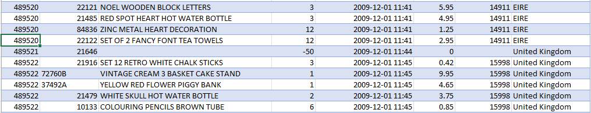
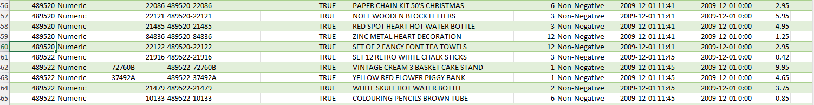
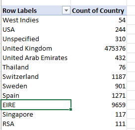
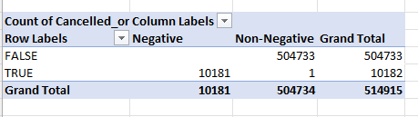

# Online Retail Data Cleaning & RFM Analysis (Excel)

Cleaning, validating, and analyzing ~1 million rows of real UK online retail transaction data in Excel — culminating in an RFM (Recency, Frequency, Monetary) customer segmentation.

## Dataset

**Source:** [UCI Machine Learning Repository — Online Retail II](https://archive.ics.uci.edu/dataset/502/online+retail+ii)

Transactional data from a UK-based, non-store online retailer between December 2009 and December 2011. The company mainly sells all-occasion gift-ware, with a customer base that includes both individual consumers and wholesalers.

> Raw data is not included in this repo due to size. Download it directly from the link above to reproduce the steps below.

## Objective

Take a genuinely messy, real-world transactional dataset and produce a clean, analysis-ready version — while documenting the reasoning behind every cleaning decision — then use it to segment customers by purchasing behavior (RFM) to inform retention/marketing strategy.

## Tools Used

- Microsoft Excel — Tables, structured references, PivotTables, conditional formatting, data validation
- Power Query — for operations too slow to run natively on a dataset this size (grouping, filtering, duplicate detection)

## Process

A column-by-column audit, with every decision validated against evidence in the data rather than assumed. Full reasoning and dead-ends are documented in [`data-cleaning-log-detailed.md`](./docs/data_cleaning_logs.md).

1. **Setup** — converted raw data into an Excel Table for structured referencing and reliable filtering at scale
2. **Description** — found blank descriptions almost entirely paired with Price = 0 and no CustomerID; confirmed these were non-product write-off entries, labeled and excluded rather than deleted outright
3. **StockCode** — identified trailing letters (e.g., `48173C`) as legitimate product variants, not errors; separately flagged genuinely non-product codes (`POST`, `D`, `M`, etc.) via an `Is_Product` column
4. **Invoice** — surveyed all invoice-number prefixes before categorizing (not just the first one found), producing a complete `Sale_or_Not` classification: Normal Sale / Cancellation / Adjustment
5. **Quantity** — tested (rather than assumed) whether negative quantity aligns with cancellations, using a PivotTable cross-tab; investigated the single exception found and traced it to an already-flagged non-product row
6. **InvoiceDate** — verified proper date typing and range; separated date from time-of-day for Recency calculations
7. **Price** — confirmed negative-price rows were already accounted for by existing flags
8. **CustomerID** — flagged (not deleted) missing values, since these rows remain valid for revenue analysis but must be excluded from customer-level segmentation
9. **Country** — audited all unique values via PivotTable; distinguished genuine inconsistencies (casing) from legitimate but unusual entries (Channel Islands, EIRE, Unspecified)
10. **Duplicate line items** — defined duplicates precisely as repeated Invoice+StockCode pairs (not repeated invoices, which are normal); used Min/Max comparison logic in Power Query to distinguish true redundant entries from legitimately separate transactions

## Key Findings

*(To be completed once RFM analysis is finished — e.g., customer segment sizes, top segments by revenue contribution, revenue lost to cancellations, etc.)*

## Screenshots

**Description column — before and after cleaning**

Blank Description cells were paired almost entirely with Price = 0 and no CustomerID — confirmed as non-product/write-off entries rather than genuine data-entry gaps. Rather than deleting these rows outright, blanks were labeled `"Missing"` to preserve the row for revenue reconciliation, with the underlying non-product rows excluded separately later based on StockCode.

| Before | After |
|---|---|
|  |  |

**Country values — audited via PivotTable**

Every unique Country value was reviewed rather than skimmed. A few entries that initially looked like anomalies — `EIRE`, `Channel Islands`, `Unspecified` — were investigated individually and confirmed to be legitimate categories (Ireland's dataset label, a distinct UK Crown Dependency, and a deliberate placeholder, respectively), not data errors.

**Duplicate detection logic — Power Query**

Duplicates were defined precisely as repeated **Invoice + StockCode** combinations (not repeated Invoice numbers, which are normal — one invoice legitimately has many product lines). Grouped by Invoice + StockCode, then compared Min/Max of Quantity, Price, and InvoiceDate within each group — if Min equals Max across all three, the group is a true redundant duplicate; if any differ, it's a legitimately separate transaction.

*(Finding: zero groups qualified as exact duplicates — every repeated Invoice+StockCode pairing differed in at least one of Price, Quantity, or Date, meaning no rows needed to be removed.)*

## Limitations & What I'd Do Differently

*(To be completed)*

---
